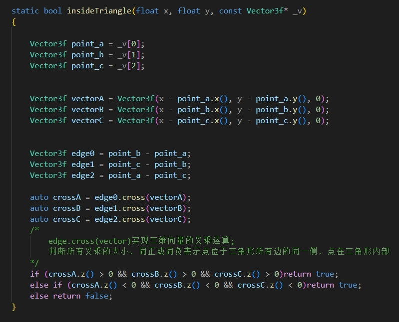
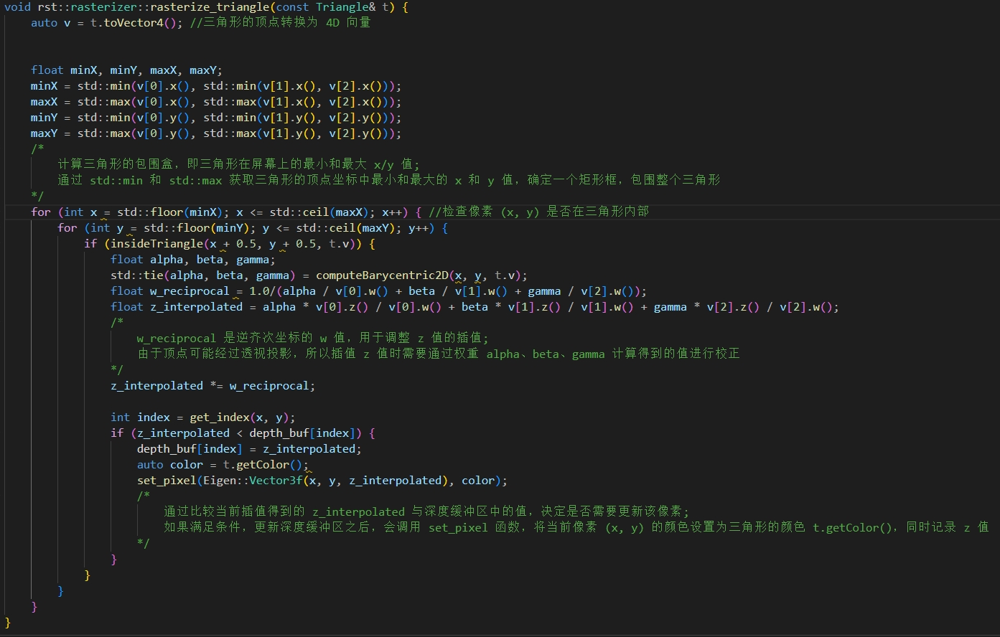
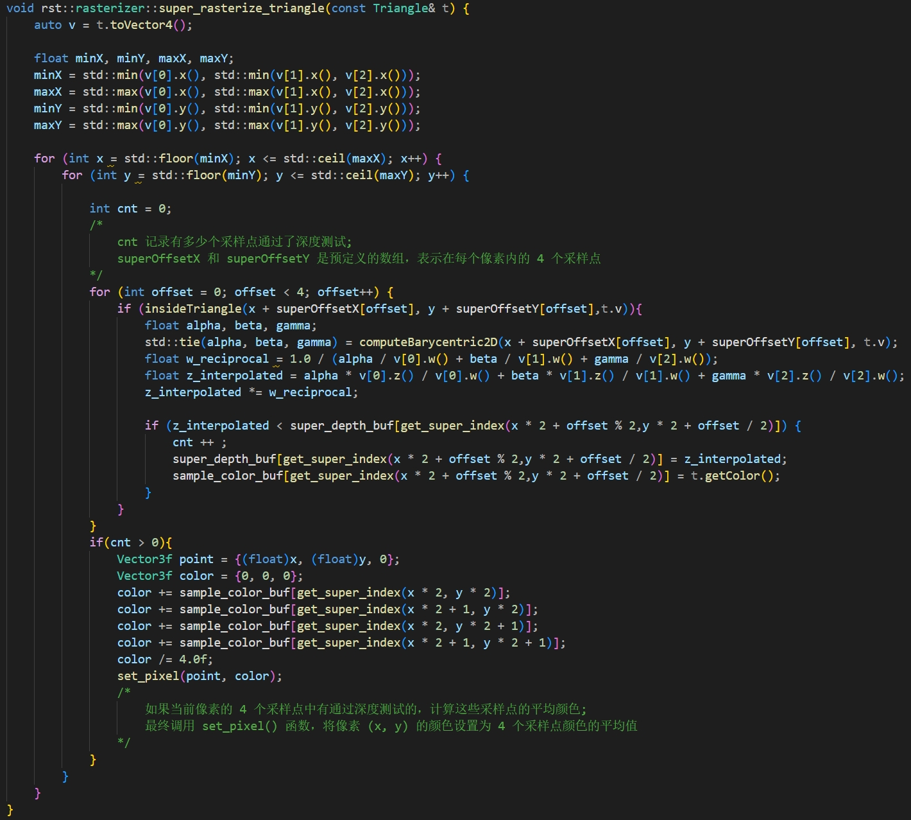
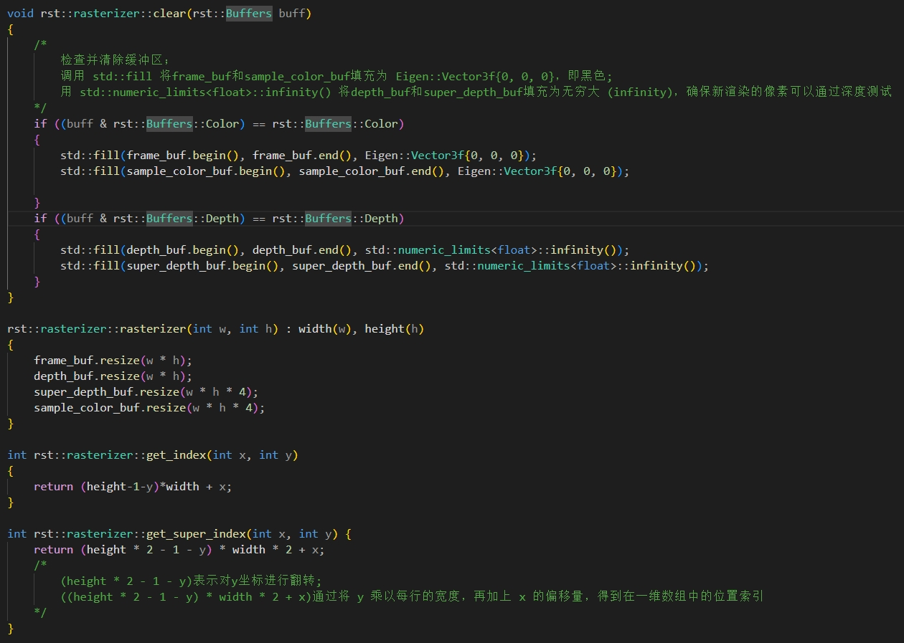
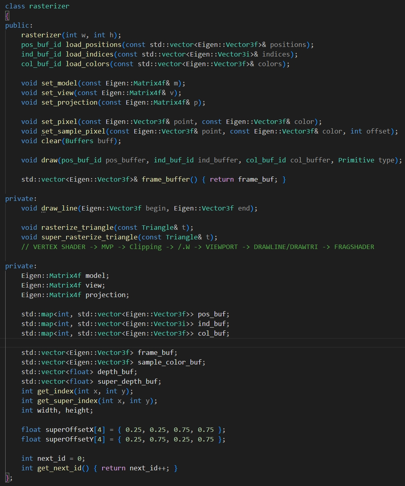
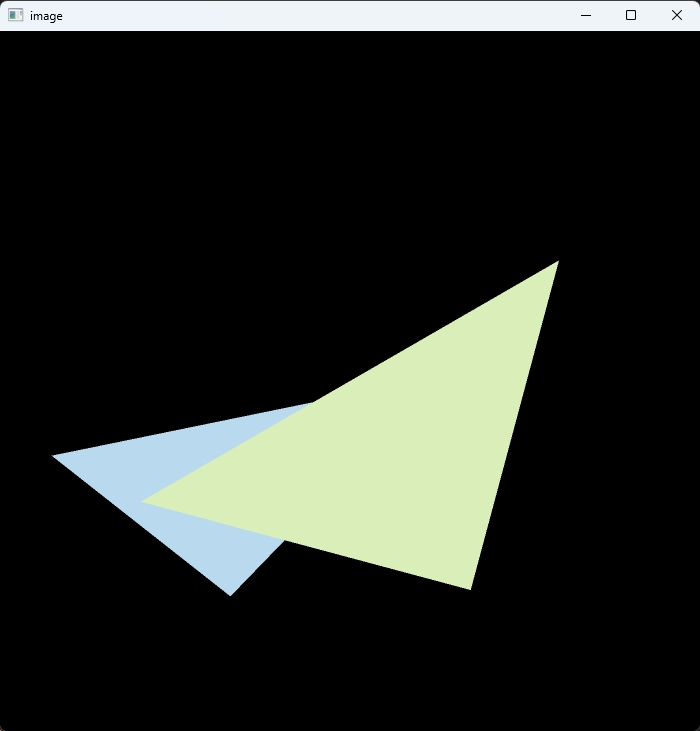

<h1 align = "center">计算机图形学第一次作业</h1>

<h4 align = "right">072203231 潘子睿</h4>

## 实验内容

### 1.补充insideTriangle函数，判断点是否在三角形内部 

  

### 2.对三角形进行光栅化处理

  

### 3.改善算法实现超采样

  

### 4.关于超采样的初始化和缓冲区设置

 

### 4.在rasterizer.hpp中定义新添加的函数以及数组

 

### 5.最后结果

  